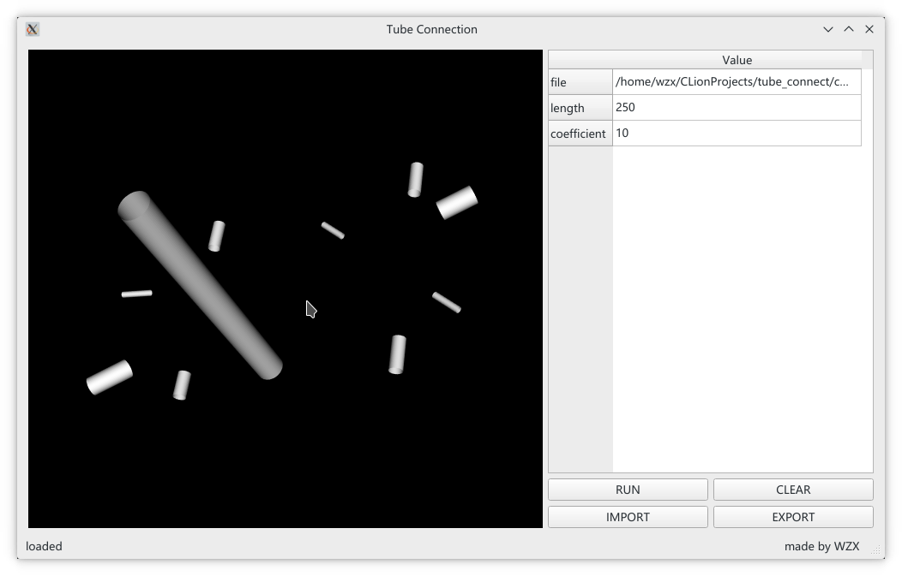
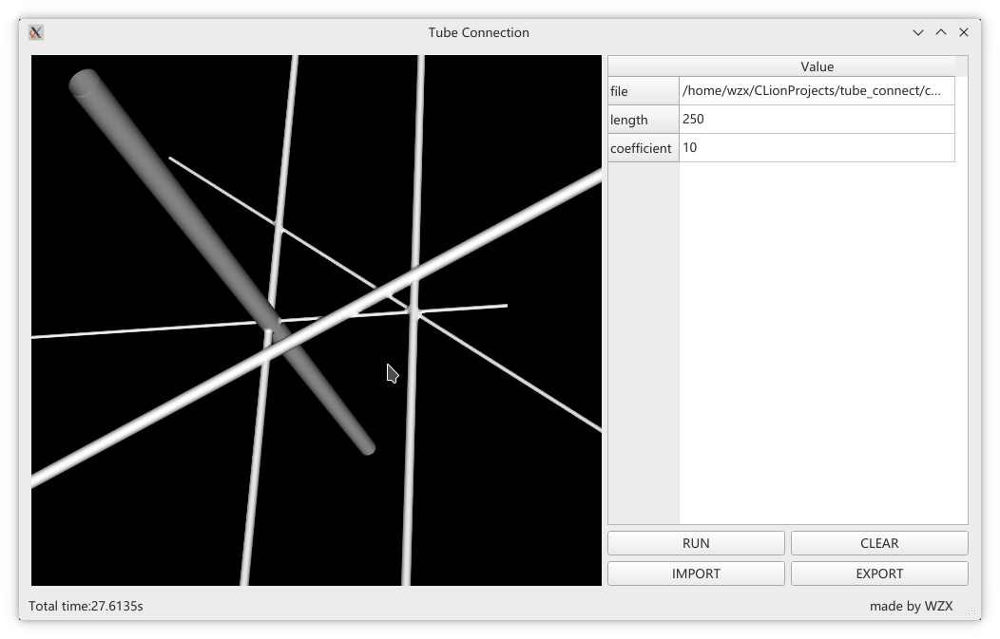

## tubes connect
Import a stl file which contains many unconnected tubes, the program will connect them automatically

### PREREQUISITES
* GCC
* VTK
* CMake
* QT5

### BUILD
#### LINUX
- just run `cd tube_connect`, `cmake .`and `make` 
  
- or you can use out-of-source-build
```
cd tube_connect
mkdir build
cd build
cmake ..
make
```
- If VTK is not installed but compiled on your system, you will need to specify the path to your VTK build  
`cmake -DVTK_DIR:PATH=/home/me/vtk_build ..`
- If cmake do not find QT, just run
`cmake -DCMAKE_PREFIX_PATH="path/to/Qt5/lib/cmake"`
#### WINDOWS
Be sure to add the VTK **bin** and **lib** directory to your system environment variable. So do QT.

### RUN
`./tube_connect`



### TEST
There are some test files in `./res`
- `test1.stl` : a tube
- `test2.stl` : three unconnected tubes with equal radius
- `test3.stl` : several unconnected tubes with non-equal radius
- `100.stl` : one hundred unconnected tubes with non-equal radius
- `1000.stl` : ten hundreds unconnected tubes with equal radius

### ATTENTION
1. The import file must be stl format and contain only tubes that are not connected
2. This project is no longer maintained
