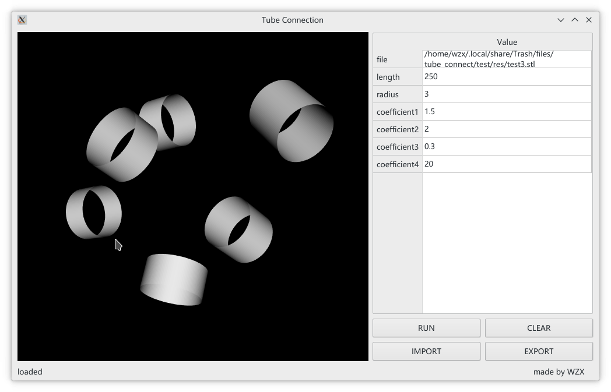
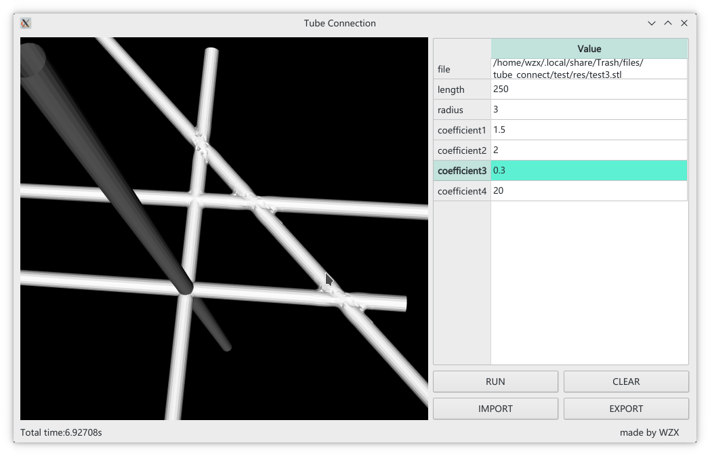

## tubes connect
Import a stl file which contains many unconnected tubes, the program will connect them automatically

### PREREQUISITES
* GCC
* VTK
* CMake
* QT5
* GTest(Optional)

### RELEASE
- [v1.0](https://github.com/wzx140/Tube_connect/releases/tag/v1.0)



### BUILD
#### LINUX
- just run `cd tube_connect`, `cmake .`and `make` 
  
- or you can use out-of-source-build
```
cd tube_connect
mkdir build
cd build
cmake ..
make
```
- If VTK is not installed but compiled on your system, you will need to specify the path to your VTK build  
`cmake -DVTK_DIR:PATH=/home/me/vtk_build ..`
- If cmake do not find QT, just run
`cmake -DCMAKE_PREFIX_PATH="path/to/Qt5/lib/cmake"`
#### WINDOWS
Be sure to add the VTK **bin** and **lib** directory to your system environment variable. So do QT.

### RUN
`./tube_connect`

### TEST
If you want to run the test, you should build the source in test mode with `cmake -DBUILD_TEST=ON`. Then just run `cd test` and `./tube_connect_test`

### ATTENTION
1. The import file must be stl format and contain only tubes that are not connected
2. The radius of each tube must be equal 
3. The connection only create in the intersection of the center line of the tubes 
